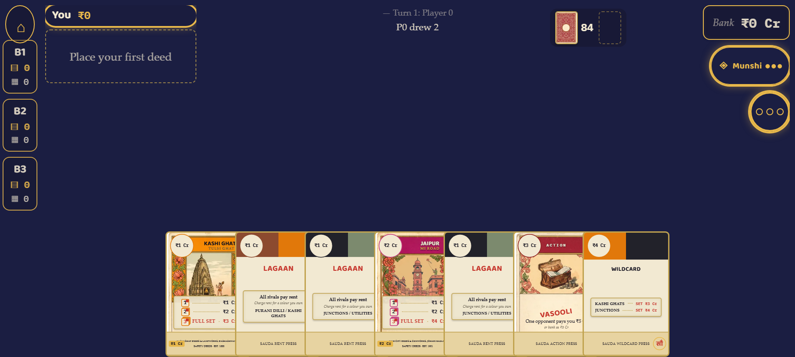
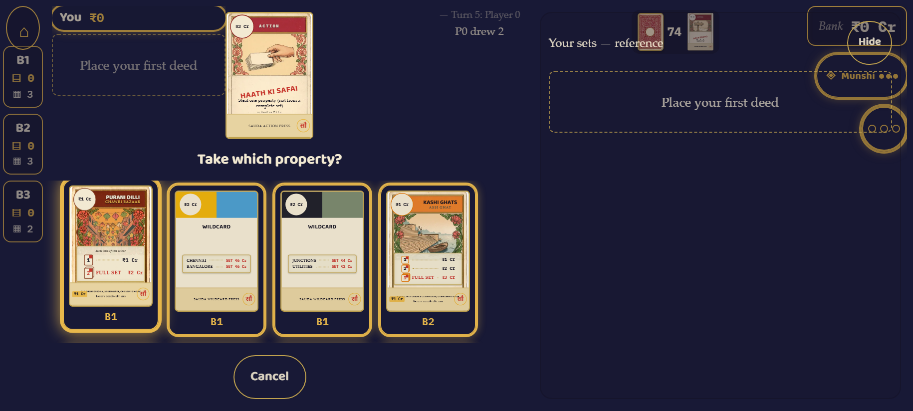
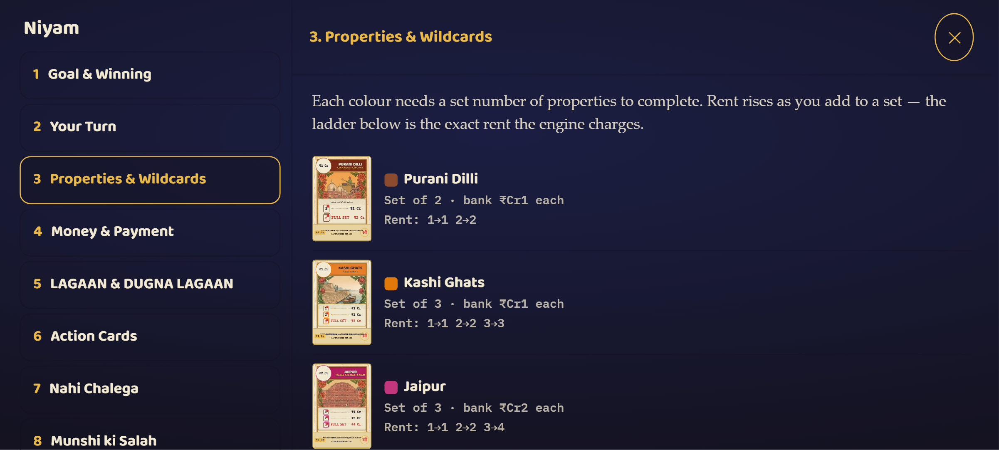

# SAUDA (सौदा)

**An original Indian-themed property card game — set-collection meets take-that —
for the web and Android.** Race three AI opponents to lock down **3 complete
property sets in 3 different colours** before they do, wielding rent, seizures,
swaps and the all-important *Nahi Chalega!* to cancel what's played against you.

### ▶ Play it now: **[sauda-rouge.vercel.app](https://sauda-rouge.vercel.app)**

> **Open it on a phone and turn it sideways.** SAUDA is landscape-only by design —
> in portrait it shows a rotate prompt. Solo vs bots, fully offline, no accounts,
> no backend.

---

<p align="center">
  
</p>
<p align="center"><em>The play surface — your hand spreads along the bottom, your colour columns down the left, the Munshi advisor on the right.</em></p>

<p align="center">
  
  
</p>
<p align="center"><em>Left: every card is a real hand-painted deed face (a <strong>Haath Ki Safai</strong> steal, picking a target property). Right: the in-game <strong>Niyam</strong> book, whose numbers are read straight from the engine so they can never drift from the rules.</em></p>

---

## What it is

SAUDA is a **106-card** property game with a **₹57 Cr** money economy. You draw,
you place properties into colour groups, and you play action cards to charge rent
(*Lagaan*), seize a whole set (*Kabza*), pinch a single property (*Haath Ki Safai*),
swap deeds (*Adla-Badli*) or cancel an attack (*Nahi Chalega!*). First to **three
complete sets in three distinct colours** wins.

Everything a player reads — the game name, the ten cities, every street, every
action-card name, all the artwork — is **original**. No third-party names, rule
wording, or trade dress appears anywhere; a whole-repo guard test enforces that on
every commit.

The ten colours are Indian cities and civic groups — Purani Dilli, Kashi Ghats,
Jaipur, Kolkata, Chennai, Bangalore, New Delhi, Mumbai, plus Junctions and
Utilities — each an original set of streets with its own rent ladder.

## Tech

A **pnpm + TypeScript monorepo** with a hard architectural spine: a pure rules
engine that nothing else is allowed to second-guess.

| Workspace | What it is |
|-----------|-----------|
| **`packages/engine`** | The rules, as a pure deterministic state machine. Seeded RNG, zero runtime deps beyond `zod`. Exposes `legalActions()` and `reduce()`. |
| **`packages/bots`** | `RandomBot` + `HeuristicBot` (`recommend()`) — decide only from the engine's legal moves. |
| **`packages/difficulty`** | A wrapper that degrades the full-strength bot by tier (easy / medium / hard) — deterministically, using only the seeded RNG. |
| **`apps/mobile`** | The React + Vite play surface (the app you play in the browser). |
| **`tools`** | The CLI game (`pnpm play`), the 1000-game simulator, and the deterministic scenario fixtures. |

**Stack:** TypeScript (strict), React 18, Vite 5, Zustand; `zod` in the engine;
`fast-check` for property tests; Playwright for the capture harness; `sharp` for
the card-art build step. Toolchain pinned for reproducibility — Node `24.15.0`
(`.nvmrc`), pnpm `11.17.0`. A native Android build via Capacitor is planned (M5,
not started); the web build is the shipping target today.

### Run it locally

```bash
pnpm install
pnpm gate         # ip-guard → typecheck → lint → all 462 tests (the green-before-commit wall)
pnpm --filter @sauda/mobile dev   # play in the browser
pnpm play                         # play in the terminal, you vs 3 bots
pnpm simulate --games 1000        # bot-strength + invariant harness
```

## The engineering story

The parts of this project worth a second look — each verifiable in the repo:

- **A frozen, pure engine.** `packages/engine` is a deterministic state machine:
  `reduce(state, action)` is the only thing that mutates state, and
  `legalActions(state, player)` is the only source of what's allowed. Illegal moves
  come back as data (a `RuleViolation`), never an exception. The UI renders *only*
  from `legalActions` and `observe` — **the UI never decides a rule.** The engine
  (and the bots) are held **byte-identical** through every UI and difficulty change.

- **Determinism is enforced, not hoped for.** The RNG is a single integer in the
  state, so the same seed reproduces the same game exactly (needed for replay,
  debugging and the simulator). `Math.random` is **banned in the engine** by an
  ESLint rule.

- **A bot that actually plays well — measured.** The 1000-game simulator (fresh
  run: **958 / 1000 = 95.8% win, 20.27 average turns, longest 39, zero invariant
  violations**) gates on §8.3: ≥90% win, ≤25 avg turns, 0 violations. At the table,
  the difficulty wrapper turns a single strong brain into three real tiers — against
  a strong player at the full 3-bot table the human's win share runs **easy ~74% ·
  medium ~46% · hard ~23%** (hard is the real bot; ~25% is the fair share).

- **462 tests, split by package** — engine **76** · bots **14** · difficulty **9** ·
  tools **15** · mobile **348** — run on every commit.

- **A red commit is impossible.** A versioned `.githooks/pre-commit` (wired via
  `core.hooksPath`, so it travels with the branch) runs `pnpm gate` — ip-guard →
  typecheck → lint → the full test suite — and blocks the commit if anything is red.

- **A two-layer card system.** Each of the 106 cards is one `CardFace`: a static art
  plate (a `.webp` painting with *no text*) plus a live layer that draws every
  number, name and icon from engine data. One face design, rendered pixel-identical
  at any size via `ScaledCard`; art can be swapped in with no code change.

- **Deterministic scenario fixtures.** `tools` can replay any game state from a seed,
  so specific situations (an overpay, a NAHI chain, a steal with no fixed target) are
  reproduced exactly for tests and capture.

- **A device-profile capture harness.** Playwright drives the real UI at pinned phone
  profiles (e.g. 740×360, 915×412) and records stills + `.webm` clips, so claims about
  layout, legibility and motion are backed by committed evidence, not assertion.

Full narrative crib sheet: **[`EXPLAIN.md`](EXPLAIN.md)**. Diagrams of every layer
above: **[`docs/ARCHITECTURE.md`](docs/ARCHITECTURE.md)**.

## How to read this codebase

Four files show the whole design in miniature:

1. **[`packages/engine/src/legal.ts`](packages/engine/src/legal.ts)** — `legalActions`,
   the single source of truth for what a player may do. Read this first.
2. **[`packages/engine/src/reduce.ts`](packages/engine/src/reduce.ts)** — the one
   place state changes; the turn/interrupt state machine lives here.
3. **[`apps/mobile/src/game/interaction.ts`](apps/mobile/src/game/interaction.ts)** —
   the pure interaction reducer that maps a finger's intent to a legal engine action
   (and to nothing when the intent is illegal).
4. **[`apps/mobile/src/components/CardFace.tsx`](apps/mobile/src/components/CardFace.tsx)**
   — the two-layer card, and **[`packages/difficulty/src/index.ts`](packages/difficulty/src/index.ts)**
   — how one bot brain becomes three honest difficulty tiers.

## Status

**Works today:** a full solo game (you vs 3 bots) deals, plays and wins end-to-end
in the browser, landscape, at phone profiles; three difficulty tiers; the **Munshi**
advisor (a read-only consultant that shares the bot's brain, 3 uses/game); the
**Niyam** learn book; drag-to-play with tap-to-inspect; hidden opponent bank cash.

**Planned:** a native Android package via Capacitor (M5), a first-run tutorial and
sound/haptics (M4c), and — out of scope for v1 — online multiplayer. See
[`docs/STATUS.md`](docs/STATUS.md) for the honest, evidence-backed snapshot.

## License

**All rights reserved — source available for review.** The code is public so it can
be read and evaluated; it is not open-source. This is deliberate: SAUDA is an
original game headed for a store, so a permissive licence (which would let anyone
reskin and republish it) is the wrong default. See [`LICENSE`](LICENSE).

## Guardrails

The project's non-negotiables live in [`CONTRIBUTING.md`](CONTRIBUTING.md): no third-party IP;
all player-facing text in one `theme.ts` (a rebrand is one file edit); seeded RNG
only; never weaken a test to make it pass; a readability contract because the code
is meant to be explained line-by-line.
