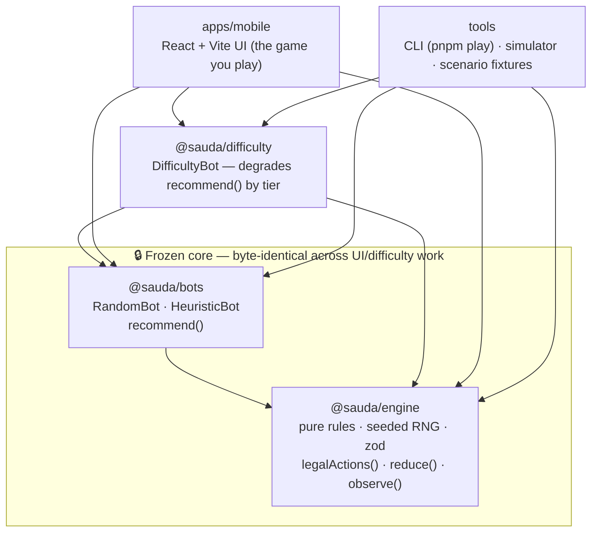
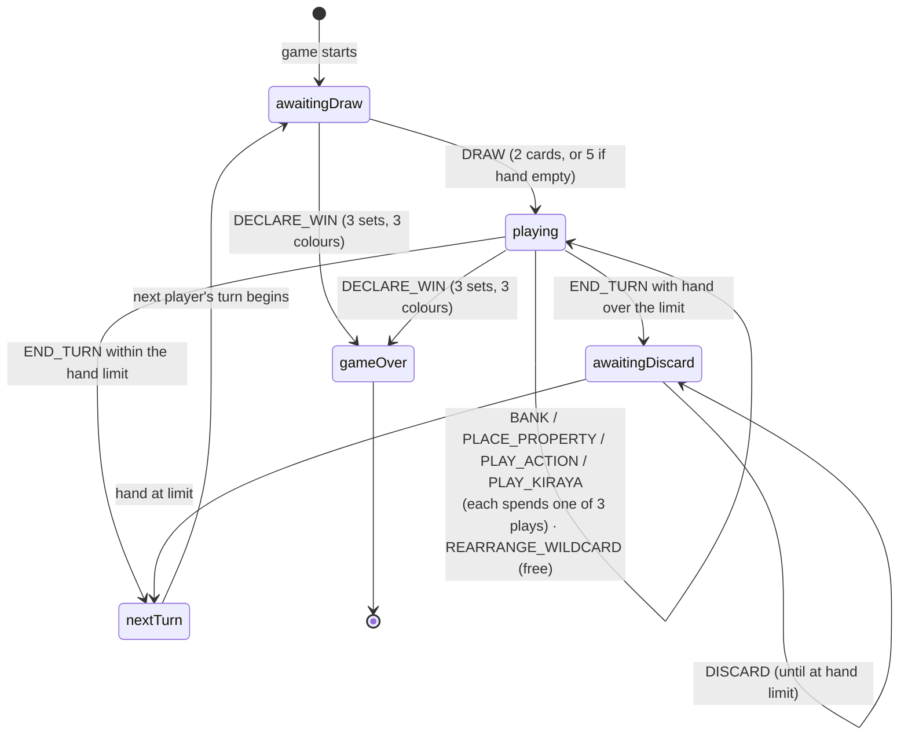
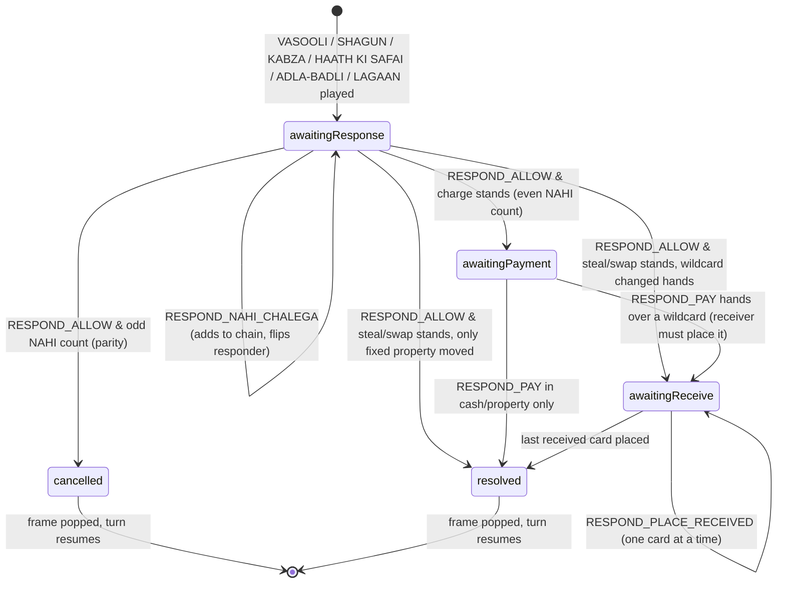
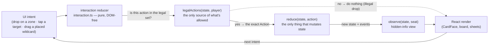
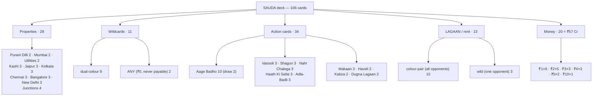
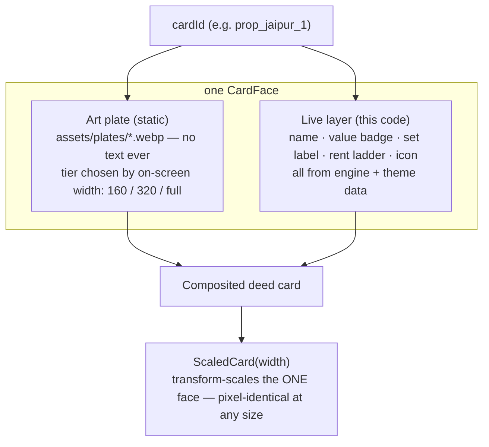
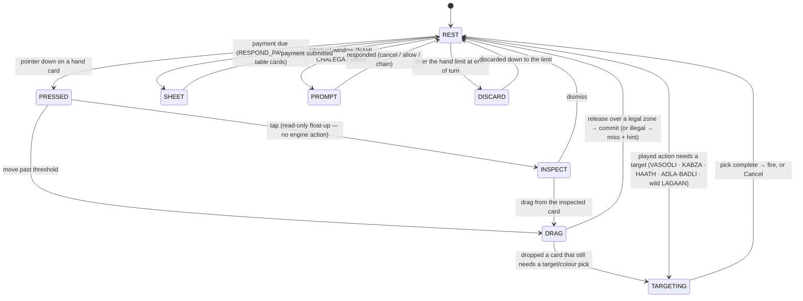

# SAUDA — Architecture

Diagrams derived directly from the code (`packages/engine`, `packages/difficulty`,
`apps/mobile`). Every phase, action and count below is read from the source, not
sketched from memory. Read [`../EXPLAIN.md`](../EXPLAIN.md) for the plain-English
narrative behind these shapes and [`../docs/STATUS.md`](STATUS.md) for what is
built today.

The one idea that unifies all six diagrams: **the engine is the only thing that
knows the rules.** It exposes two pure functions — `legalActions(state, player)`
(what may happen) and `reduce(state, action)` (what happens) — and everything else
(bots, difficulty tiers, the React UI) may only choose from, or render, what those
two functions already decided.

---

## 1. Monorepo dependency graph

Five workspaces. The arrows are real `package.json` dependencies. The **frozen
core** — `@sauda/engine` and `@sauda/bots` — is held byte-identical: the difficulty
wrapper and the whole UI only *sequence and render* what the core already produces,
so a rebrand or a UI change can never alter a rule or a bot decision.

`@sauda/engine` has **zero runtime dependencies beyond `zod`**. The dependency
arrows only ever point *toward* the engine — nothing the engine imports can know
about the UI, which is what keeps it a pure, testable core.

---

## 2. Game state machine (the engine's phases)

`TurnPhase` in [`packages/engine/src/state.ts`](../packages/engine/src/state.ts)
is exactly four states; the transitions are enforced in
[`reduce.ts`](../packages/engine/src/reduce.ts). A turn is draw → play up to three
times → (discard if over the hand limit) → next player.

### 2a. The interrupt window (a charge/steal freezes the turn)

A charge or steal is **not** applied immediately. It becomes a frame on
`pendingInterrupts` and opens a response window; while a frame is open, *only that
frame's `responder`* has any legal moves — which is how the turn freezes and how
**NAHI CHALEGA** can be played off-turn. The frame's own `InterruptStatus` is the
sub-state machine:

The charge **stands iff an even number of NAHI CHALEGA cards were played** — a
parity count that is proven equivalent to the spec's literal last-in-first-out
stack for chain depths 0–4 in `interrupts.test.ts`.

---

## 3. The action loop (the UI never decides a rule)

One round trip from a finger on the glass to a re-rendered board. The interaction
reducer ([`apps/mobile/src/game/interaction.ts`](../apps/mobile/src/game/interaction.ts))
is **pure and DOM-free**: it maps a UI intent to an engine `Action`, but every
action it can return was already enumerated by `legalActions`. An illegal intent
maps to nothing.

Because both the drag layer and the tap rail funnel through this one mapping, they
fire **byte-identical actions** — a guarantee unit-tested without a browser, not
eyeballed across two components.

---

## 4. Card taxonomy — the 106-card deck

Built by [`deck.ts`](../packages/engine/src/deck.ts) from the data in
[`theme.ts`](../packages/engine/src/theme.ts). The exact 28 / 11 / 34 / 13 / 20
split and the ₹57 Cr money total are asserted by `deck.test.ts` — if the deck
drifts, the build goes red.

**Win condition:** hold **3 complete sets across 3 different colours**
(`hasThreeCompleteSets` → `distinctCompleteColorCount ≥ 3`). Two complete Jaipur
sets plus one Mumbai set is three sets but only two colours — not a win.

---

## 5. The two-layer card render

Every card on screen is one `CardFace`
([`apps/mobile/src/components/CardFace.tsx`](../apps/mobile/src/components/CardFace.tsx)).
The **art plate** is a static `.webp` painting that carries *no* text or numerals;
the **live layer** draws every number, name and icon from engine/theme data on top.
The plate gives the look; the live layer guarantees the values are correct and crisp
at any size.

There is exactly **one** face design. To show a card smaller on the table, callers
wrap it in `ScaledCard`, which CSS-scales the *same* full render — so a table-size
deed is pixel-for-pixel the same design as the hand card. If a plate is missing, the
face falls back to a text-free SVG; art can be dropped in later with no code change.

---

## 6. The interaction contract (touch state machine)

The play surface is DRAG-first with tap as an equal fallback (M4b interaction spec,
`docs/M4B_INTERACTION_SPEC.md` / `docs/M4B_STATE_MATRIX.md`), implemented across the
Board's interaction state. A hand card is either being read (INSPECT) or being
committed (DRAG); on-board choices open one modal surface at a time.

Only one of `TARGETING` / `SHEET` / `PROMPT` / `DISCARD` is ever live at once, and
each is driven entirely by `legalActions` — the overlay glows only the choices the
engine already allows.
